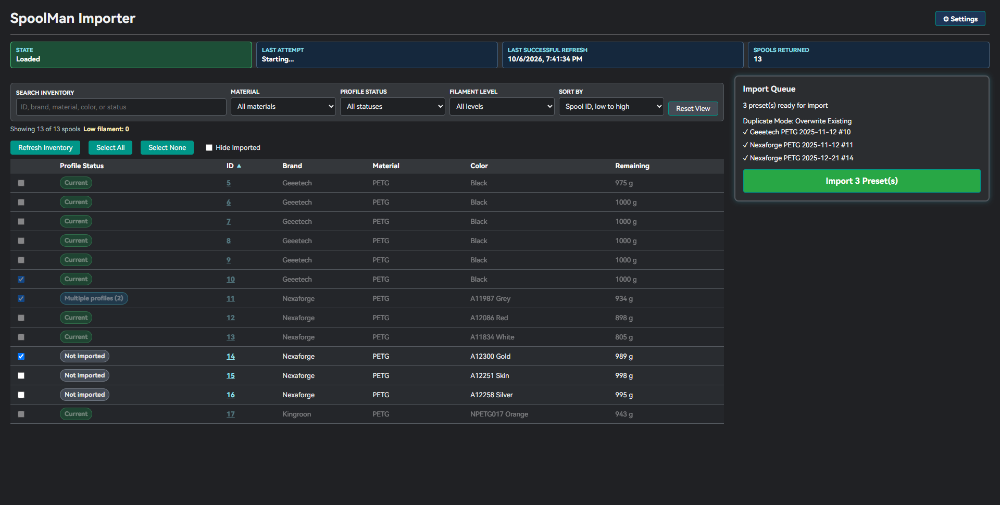
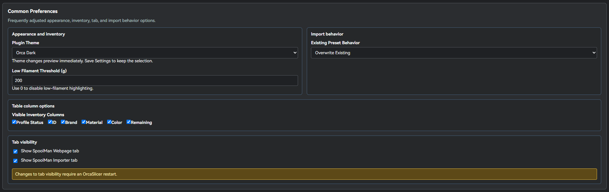
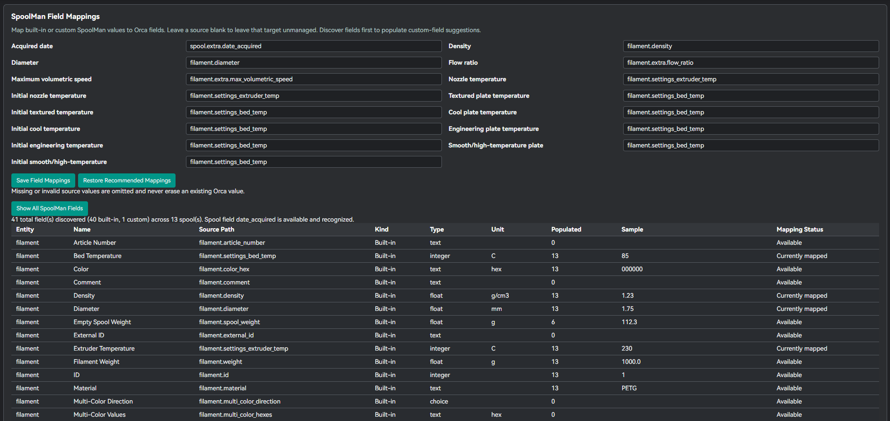
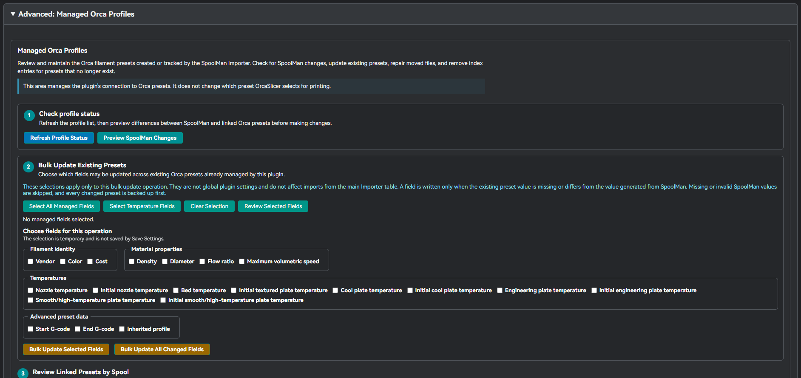
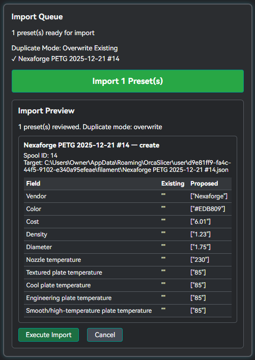
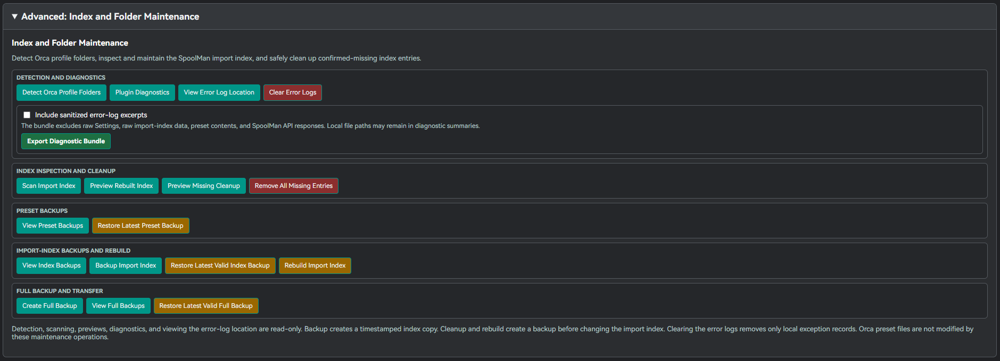

# OrcaSlicer SpoolMan Importer

An OrcaSlicer plugin that reads SpoolMan inventory and creates or maintains OrcaSlicer filament presets.

> [!CAUTION]
> This is a development prerelease tested on **OrcaSlicer 2.5.0-dev**. Compatibility with other OrcaSlicer versions has not yet been fully verified. The plugin can create and update OrcaSlicer filament presets.

**!! You should create a full backup of your OrcaSlicer profile before testing imports, synchronization, cleanup, or restoration !!**

[Installation Guide](INSTALLATION.md) | [Configuration Guide](CONFIGURATION.md) | [Field Mappings](FIELD_MAPPINGS.md) | [Backup and Restore](BACKUP_AND_RESTORE.md) | [Troubleshooting](TROUBLESHOOTING.md) | [Contributing](CONTRIBUTING.md) | [Changelog](CHANGELOG.md)

## **Features**

### Inventory and Importing

- Browse SpoolMan inventory inside OrcaSlicer.
- Search, filter, sort, and customize visible inventory columns.
- Highlight and filter low-filament spools.
- Open individual SpoolMan records in the default external browser.
- Preview generated filament presets before writing files.
- Configure how existing preset files are handled.
- Automatically remove hidden rows from the active Import Queue selection.

### OrcaSlicer Preset Management

- Generate OrcaSlicer filament presets from SpoolMan records.
- Track one or more Orca preset files linked to a SpoolMan spool.
- Preview SpoolMan-derived changes before synchronization.
- Bulk update selected managed fields in existing presets.
- Detect missing, moved, renamed, and locally modified presets.
- Choose a default future update target for multi-profile spools.
- Back up presets before managed changes.

### SpoolMan Field Integration

- Discover built-in and custom spool, filament, and vendor fields.
- Configure SpoolMan-to-Orca field mappings.
- Map regular and initial-layer plate temperatures independently.
- Validate numeric values before writing them.
- Support optional spool custom fields such as `date_acquired`.

### Recovery, Diagnostics, and Updates

- Preset backups.
- Import-index backups.
- Full ZIP backup and computer-transfer workflows.
- Pre-restore safety backups.
- Diagnostic export with optional sanitized error excerpts.
- Stable and Development update-notification channels.
- Orca Dark, Midnight Blue, Graphite, and Light themes.

## Getting Started

It is recommended to use the Orca Cloud plugin: https://cloud.orcaslicer.com/p/4e00554f8f78
You must be using a build that supports plugins (currently the nightly builds)
https://www.orcaslicer.com/download/

## Alternative Manual Download and Installation

1. Download `spoolman_plugin_win_x86_64.py` from the [GitHub Releases page](https://github.com/StodgyWaif/orcaslicer-spoolman-plugin/releases).
2. Open OrcaSlicer's **Plugins** window.
3. Select **Install local plugin**.
4. Choose `spoolman_plugin_win_x86_64.py`.
5. Fully restart OrcaSlicer.
6. Open **SpoolMan Importer > Settings**.

## Screenshots

### Inventory and Import Queue

### Settings and Common Preferences

### Field Mappings and SpoolMan Field Reference

### Managed Orca Profiles

### Import Preview

### Backup and Maintenance

## Requirements

- A compatible OrcaSlicer build with Python plugin support.
- Tested development environment: **OrcaSlicer 2.5.0-dev**.
- A reachable SpoolMan server.
- Permission to write to the selected OrcaSlicer user filament-preset folder.

## Data and Synchronization Model

The plugin primarily treats **SpoolMan as the source** for managed filament values and **OrcaSlicer presets as the destination**.

The plugin does not provide general two-way synchronization from OrcaSlicer back to SpoolMan.

Before changing an existing managed preset, the plugin:

1. Generates proposed values from the current SpoolMan record.
2. Compares those values with the linked Orca preset.
3. Displays a synchronization preview.
4. Skips missing or invalid mapped source values.
5. Creates a backup before writing a changed preset.

## Safety Model

- Imports and synchronization are preview-first.
- Existing managed presets are backed up before synchronization changes.
- Blank, missing, or invalid mapped values do not erase existing Orca values.
- Update checks do not download or install plugin files automatically.
- Cleanup actions are limited to explicitly selected or confirmed entries.

## Documentation

- [Installation](INSTALLATION.md)
- [Configuration](CONFIGURATION.md)
- [Field Mappings](FIELD_MAPPINGS.md)
- [Backup and Restore](BACKUP_AND_RESTORE.md)
- [Troubleshooting](TROUBLESHOOTING.md)
- [Contributing](CONTRIBUTING.md)
- [Security Policy](.github/SECURITY.md)
- [Changelog](CHANGELOG.md)

## Support

Use the repository's issue templates when reporting bugs or requesting features. Include complete version information and inspect diagnostic bundles before uploading them publicly.

## License

This project is licensed under the MIT License. See [LICENSE](LICENSE).
